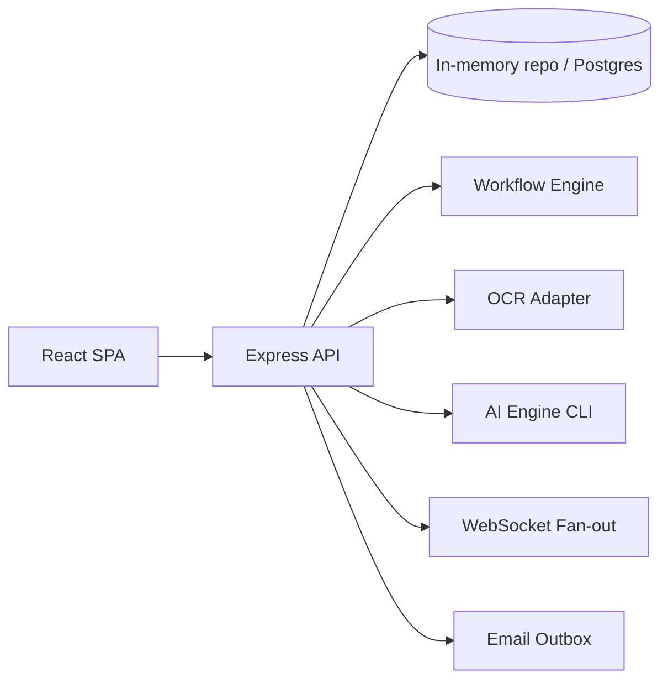

# SentinelX Architecture

## Overview

SentinelX is an **expense governance** platform combining a React console, Node.js API, deterministic AI scoring modules in Python, and a Postgres-oriented schema. The system emphasizes **RBAC**, **workflow orchestration**, **risk & trust signals**, and **auditability**.

## High-Level Diagram

## Components

- **frontend/**: Vite + React router, auth context, dashboards, approvals UX.
- **backend/**: Express REST API, JWT auth, expense CRUD, approval transitions.
- **auth/**: JWT helpers, RBAC permissions, password utilities.
- **workflow-engine/**: Rules engine, escalation tiers, approval graph.
- **integrations/**: OCR simulation, FX normalization to base currency.
- **notifications/**: Email queue stub, WebSocket broadcast helper.
- **ai-engine/**: Anomaly detection, risk/trust scoring, prediction envelope.
- **database/**: SQL DDL, migrations, seed for relational deployment.

## Data Flow (Expense Submit)

1. User submits expense via SPA → `POST /api/v1/expenses`.
2. API normalizes currency, runs OCR adapter (simulated), attaches flags.
3. Risk/trust computed (Node) — can be swapped for Python batch scoring.
4. `approval_engine` initializes workflow (auto-approve under rules, else pending).
5. Approvers act via `POST /api/v1/expenses/:id/approve` → state machine advances.
6. Notifications enqueue; WebSocket can broadcast (hook provided).

## Security Notes

- JWT signed with `JWT_SECRET` — rotate in production.
- Helmet + rate limiting enabled on API.
- RBAC enforced via middleware; expand with fine-grained ABAC as needed.

## Deployment Targets

- **Dev**: in-memory repositories for speed.
- **Prod**: Postgres using `database/schema.sql`, object storage for receipts, real OCR provider.
